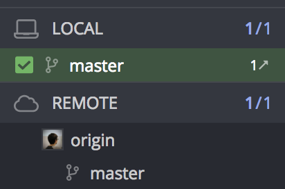
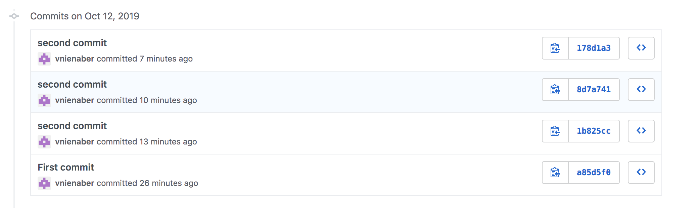
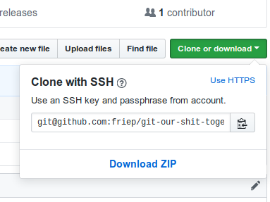
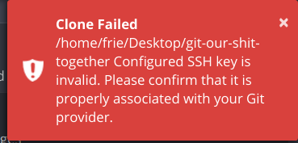
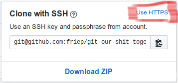

# Git(hub) 

---
### Why Git?

- masterthesis.docx
- masterthesis_v1.docx
- masterthesis_FINAL.docx
- masterthesis_FINAL_FINAL.docx

---


---

### Version Control to the Rescue!
- Example: this presentation 


---


---

### Adding and Staging Area 


---
### Commit

@box[bg-blue text-black rounded](Commit#"A commit is the Git equivalent of a "save".[...] Git committing is an operation that acts upon a collection of files and directories." ([Source](https://www.atlassian.com/git/tutorials/saving-changes))

--> Commit = A "Save Point" in Git. 


---

### Commit

- Commit saves **Changes** from the previous commit
    - changes in files
    - newly created files
    - deletion of files
    - changes in filenames
- a commit can entail multiple changes

---

### Go back in time! 


---

###  Go back in time 

@ol

- `reset master to this commit`
- spiele mit: `hard`, `mixed`, `soft`
- `fast forward master to origin/master` (oberster commit)
git reset HEAD~
git add ...                                              
git commit -c ORIG_HEAD 


@olend


(Source: [https://git-scm.com/about/staging-area](https://git-scm.com/about/staging-area))


---

### Worklfow


---

### Making a commit

Grace + Mona

@ol

-  Change stuff!
- **GIT ADD**  "Unstaged Files"   
- write a (fairly) commit message 
- **GIT COMMIT** 

@olend


---


### Git  Hosting

- Cloud! For example:

@fa[gitlab]
@fa[github]

---

### Git Local and Git Remote 

... what? 

**Lokal**: your PC
**Remote**: in the Cloud (GitHub, GitLab, ...)




---


# Sync data - Push und Pull


---


### Sync: Git Pull und Git Push

- Git Pull: download new commits from GitHub
- Git Push: push locally made commits to GitHub

---

### Sync: Git Pull and Git Push


---


--- 


### Pull and Push

@ol

- Grace: Push 
- Mona: Pull 
- Mona: Push 
- Grace: Pull

@olend

--- 


### Push and Pull


---

# When things go wrong...

---


--- 

### Git stash

@box[bg-blue text-black rounded](Stash#"git stash temporarily shelves (or stashes) changes you've made to your working copy so you can work on something else, and then come back and re-apply them later on. Stashing is handy if you need to quickly switch context and work on something else, but you're mid-way through a code change and aren't quite ready to commit". ([Source](https://www.atlassian.com/git/tutorials/saving-changes/git-stash)))

---

### Git stash


--> put it away for now!

---

### Git stash bei merge conflicts

@ol

- git stash
- git pull
- apply stash 
- solve merge conflicts 
- (delete stash)

@olend


---

### Hands on 5: Merge conflicts

---

# mit GitHub arbeiten


---

### Issues

@ul

- issues: Todos / Bugs / Ideas
- every issue has a number
- #issueno in commit message links message to commit

@ulend

---

### Hands On 4: Issue

@ol

- Mona: Issue erstellen: "Grace's LieblingsGIF fehlt"
- Grace: füge der Präsentation eine neue Folie hinzu mit deinem Lieblingsgif (giphy -> copy link)
- Grace: add + commit. verlinke issue Nummer in der commit message (#issueno)
- Grace: push
- Mona: Issue neu laden (STRG+R)

@olend

---

# Branches

---


[picture of complicated gitkraken with a lot of branches]

---


---


### Branches

@box[bg-blue text-black rounded](Branch#A branch represents an independent line of development. Branches serve as an abstraction for the edit/stage/commit process. You can think of them as a way to request a brand new working directory, staging area, and project history. [Source](https://www.atlassian.com/git/tutorials/using-branches))

---

### Branches

@box[bg-blue text-black rounded](Checkout#The git checkout command lets you navigate between the branches created by git branch. Checking out a branch updates the files in the working directory to match the version stored in that branch, and it tells Git to record all new commits on that branch. Think of it as a way to select which line of development you’re working on. [Source](https://www.atlassian.com/git/tutorials/using-branches/git-checkout))

---

### Why branches?

@ul

- keep "master" branch free of "unfinished" code
- independent creation of code ("feature branches")
- experiments

@ulend

---

### Branches Workflow

@ol

- Branch erstellen
- normal weiterarbeiten (pull-commit-push cycles)
- (optional: merge andere branches in deinen branch um Updates zu bekommen)
- merge Branch in master branch 

@olend

---

### Merging branches

- Rechtsclick auf branch name / master
- hängt davon ab, wer "weiter vorne" ist (?)
    - wenn neue commits auf master: merge master into #1-add-branch-slides -> branch wird geupdatet
    - wenn neue commits auf branch: merge #1-add-branch-slides into master -> master wird geupdatet


---

### Branches Fazit

@ul

- useful if working across different teams
- Example: developing packages 
- For Data Analytics / Data Science projects?
 
@ulend


---


# Download the data - Fork und Clone

---

### Fork und Clone


@box[bg-blue text-black rounded](Repository#"A Git repository is a virtual storage of your project. It allows you to save versions of your code, which you can access when needed." ([Source](https://www.atlassian.com/git/tutorials/setting-up-a-repository)))

@box[bg-blue text-black rounded](Fork#"A fork is a copy of a repository. Forking a repository allows you to freely experiment with changes without affecting the original project." ([Source](https://help.github.com/articles/fork-a-repo/))


---

# Save Data - Add and Commit 


--- 

- git --version
- git init
- git status
- git add .
- git status
- git commit - "First commit"

- git remote add origin https://github.com/vnienaber/git_overview.git

- git push -u origin master

- git log

- git checkout 178d1a3d2372ae60b3bdb5182278c52383dd07bc

- git revert 178d1a3d2372ae60b3bdb5182278c52383dd07bc

---

### Commit history




---

### How do we want to use it?

- command line
- 

---

### When things go wrong...

@ol

- so lange nichts gepusht ist, alles (halbwegs) gut
    - oft committen!
- zur Not: Codestand sichern und neu clonen 

@olend 


### Hands On 1 - Fork und Clone
 
#### Mona

@ol

- [https://github.com/friep/git-our-shit-together/](https://github.com/friep/git-our-shit-together/): Fork (oben rechts)
- `https://github.com/{USERNAME}/git-our-shit-together` öffnet sich
- unter Settings->Collaborators Grace hinzufügen

@olend

---

### Hands On 1 - Fork und Clone

#### Mona & Grace



@ol

- Gitkraken Clone Repo -> Clone with URL
- Kopierten Link unter URL eintragen

@olend


---

### Oh!




---

### Oh! - Nicht-Gitkraken

```
Cloning into 'git-our-shit-together'...
git@github.com: Permission denied (publickey).
fatal: Could not read from remote repository.

Please make sure you have the correct access rights
and the repository exists.
```

---

### SSH 

@ul 

- Download: 
    - prinzipell jede*r @fa[lock-open] über `https` --> @fa[github]: @fa[check]
    - `ssh`: vorherige Einrichtung ntowendig --> @fa[github]: @fa[question]
- Upload: nur authentifizierte Personen @fa[lock]
- --> @fa[github]: @fa[question]

@ulend

---

### Authentification - Passwort

- bei jedem Push GitHub Passwort eingeben
- beachte: clone `https://...` 



--- 

### Authentification - SSH
- public key, private key cryptography (see: [Youtube](https://www.youtube.com/watch?v=AQDCe585Lnc))
- only authenticate once-> 
- clone `ssh://...`

---

### Hands On 1.1: Gitkraken mit Github verbinden

@ol

- Gitkraken Profil (rechts oben)
- Preferences->Authentification->GitHub
- connect to GitHub
- Generate SSH key and add to GitHub

@olend


---

# Thats it. Thank you!


### gerne den Tag über fragen! 