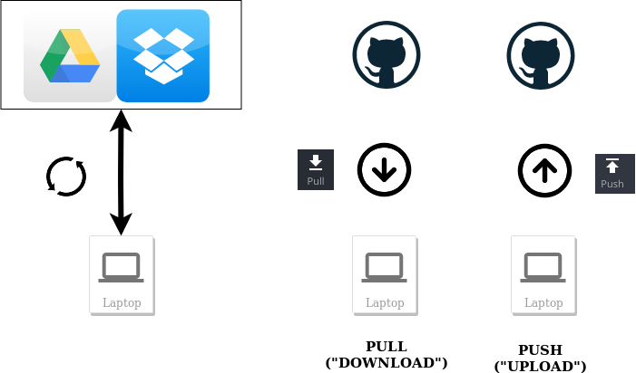
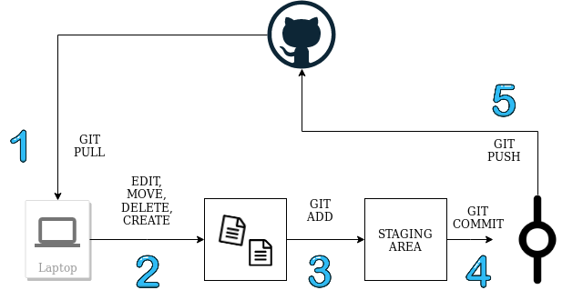
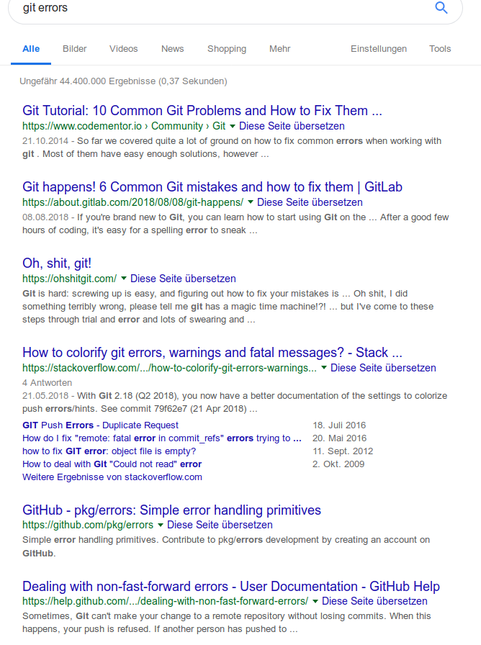

# Git(hub) 

---
### Why Git?

- masterthesis.docx
- masterthesis_v1.docx
- masterthesis_FINAL.docx
- masterthesis_FINAL_FINAL.docx

---

---

### Version Control to the Rescue!
- Example: this presentation 

# 
---

### Adding and Staging Area 

---
### Commit

@box[bg-blue text-black rounded](Commit#"A commit is the Git equivalent of a "save".[...] Git committing is an operation that acts upon a collection of files and directories." ([Source](https://www.atlassian.com/git/tutorials/saving-changes))

--> Commit = A "Save Point" in Git. 

---

### Commit

- Commit saves **Changes** from the previous commit
    - changes in files
    - newly created files
    - deletion of files
    - changes in filenames
- a commit can entail multiple changes

---

### Worklfow

---

### Making a commit

@ol

-  Change stuff!
- **git status** check on changes
- **git add**  "Unstaged Files"   
- **git commit -m "commit messeage"** 

@olend

---

---

### Go back in time! 

---

###  Go back in time 

@ol

- **git log**: see previous commits
- **git checkout <commit id>** revert changes and reset to this commit
@olend

---

### Git Hosting

- Cloud! For example:

@fa[gitlab]
@fa[github]

---

### Git Local and Git Remote 

**Local**: your PC

**Remote**: in the Cloud (GitHub, GitLab, ...)

---

# Sync data - Push and Pull

---

### Sync: Git Pull and Git Push

@ol
- Git Pull: download new commits from GitHub
- Git Push: push locally made commits to GitHub
@olend

---

### Sync: Git Pull and Git Push

---

--- 

### Pull and Push

@ol

- (**git remote add origin https://github.com/vnienaber/git_presentation.git**: add GitHub repository)
- **git push -u origin master**: push changes to the master branch
- **git pull origin master **: pull remote data (and merge with your local ones)

@olend

--- 

### Push and Pull

---

---

--- 

### Git stash

@box[bg-blue text-black rounded](Stash#"git stash temporarily shelves (or stashes) changes you've made to your working copy so you can work on something else, and then come back and re-apply them later on. Stashing is handy if you need to quickly switch context and work on something else, but you're mid-way through a code change and aren't quite ready to commit". ([Source](https://www.atlassian.com/git/tutorials/saving-changes/git-stash)))

---

### Git stash

--> put it away for now!

---

### Git stash and merge conflicts

@ol

- git stash
- git pull
- apply stash 
- solve merge conflicts 
- (delete stash)

@olend

---

# Working with GitHub

---

### Issues

@ul

- issues: Todos / Bugs / Ideas
- every issue has a number
- #issueno in commit message links message to commit

@ulend

---

### Branches

@box[bg-blue text-black rounded](Branch#A branch represents an independent line of development. Branches serve as an abstraction for the edit/stage/commit process. You can think of them as a way to request a brand new working directory, staging area, and project history. [Source](https://www.atlassian.com/git/tutorials/using-branches))

---

### Branches

@box[bg-blue text-black rounded](Checkout#The git checkout command lets you navigate between the branches created by git branch. Checking out a branch updates the files in the working directory to match the version stored in that branch, and it tells Git to record all new commits on that branch. Think of it as a way to select which line of development you’re working on. [Source](https://www.atlassian.com/git/tutorials/using-branches/git-checkout))

---

### Why branches?

@ul

- keep "master" branch free of "unfinished" code
- independent creation of code ("feature branches")
- experiments

@ulend

---

---

### Branches Workflow

@ol

- create branch
- work on your stuff (pull-commit-push cycles)
- (optional: merge different branches into yours to update them)
- merge your branch into the Master branch

@olend

---

### Branches 

@ul

- useful if working across different teams
- Example: developing packages 
- For Data Analytics / Data Science projects?
 
@ulend

---

---

### How do we want to use it?

- command line
- clients (GitKraken etc. (Pricing?))

---

# Thank you!

